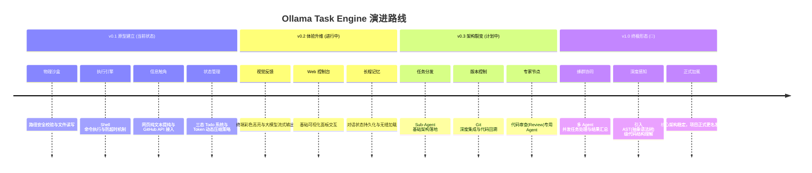

# Ollama Task Engine - 代码助手

**你的全能本地代码沙盒与智能体引擎**

拒绝 API 泄露，拒绝闭源套壳。
这是一个 100% 运行在本地算力（基于 Ollama）的极客级 Coding Agent。它不仅能理解你的需求，更能通过完整的 Tool Calling 机制直接操控物理硬盘、执行 Shell 命令、爬取最新网页并调用 GitHub API 进行深度调研。

给它一个目标，它会在安全的本地沙盒里为你构建世界。

<br />

## 💡 设计哲学

- **Local First (本地优先)**: 你的代码是你的核心资产。所有推理和文件操作均在本地完成，切断对外部商业 API 的依赖。
- **Agentic, not Scripted (智能而非脚本)**: 赋予大模型状态机（TodoList）和环境感知能力（Bash/文件读写），让它自主规划路径，而不是死板地执行预设流程。
- **Context is King (上下文即王道)**: 极度克制的内存管理策略。通过动态压缩、Token 阈值控制和日志隔离，确保在 9B/14B 这种小规模本地模型上，依然能保持长逻辑链条的绝对清醒。

## ✨ 功能特性

### ✅ 已实现功能

#### 📁 文件管理

- **读取文件** - 安全读取本地文件内容
- **写入文件** - 创建或覆盖文件，自动创建父目录
- **路径安全** - 防止目录遍历攻击，仅限工作目录内操作

#### 🖥️ Shell 命令执行

- 执行任意 Shell 命令
- 显示执行状态（成功/失败）和完整输出
- 支持超时保护（5 分钟）
- 友好的错误提示信息

#### 🔍 GitHub 集成

- **项目搜索** - 通过 GitHub API 按关键词和编程语言搜索热门项目
- **仓库详情** - 获取指定仓库的完整信息和 README 内容
- 显示 Stars、Forks、编程语言、最后更新时间等信息
- 结果自动格式化展示

#### 🌐 网页内容抓取

- 自动提取网页纯文本内容
- 移除脚本、样式、导航、页脚等无关元素
- 内容过长自动截断（3000 字符）
- 支持自定义 User-Agent

#### ✅ 待办事项管理

- 三种状态：待完成 ⬜、进行中 🔄、已完成 ✅
- 最多支持 5 个任务
- 限制同时只有 1 个进行中的任务
- 每次交互自动显示当前任务列表
- 支持任务状态切换和删除

#### 💾 智能上下文管理

- **轻量级压缩** - 旧的工具调用结果替换为占位符（保留最近 3 个完整结果）
- **自动摘要** - token 超过阈值（8000）时自动压缩对话
- **对话持久化** - 完整对话历史保存到 `transcripts/` 目录（JSONL 格式）
- **历史限制** - 最多保留最近 16 条消息
- **系统提示保留** - 始终保留第一条系统提示和用户初始请求

#### 🛡️ 安全与错误处理

- **路径安全检查** - 所有文件操作经过 `realpath` 验证
- **请求超时保护** - API 调用超时重试（最多 3 次）
- **网络错误处理** - 连接失败、超时等友好提示
- **服务健康检查** - 启动时自动检测 Ollama 服务是否可用
- **优雅退出** - 支持 `Ctrl+C`、`Ctrl+D` 和 `exit` 命令退出

***

### 🚀 未来计划功能

#### 🤖 多 Agent 架构

- **Sub-Agent 子系统** - 支持创建专用子 Agent 处理特定任务
  - 代码审查 Agent - 专门分析代码质量和潜在问题
  - 测试生成 Agent - 自动生成单元测试代码
  - 文档编写 Agent - 自动生成项目文档和注释
  - 重构建议 Agent - 分析并提出代码重构建议
- **多 Agent 协作** - 多个 Agent 之间进行对话和协作
- **任务分配** - 主 Agent 智能分配任务给合适的子 Agent
- **结果汇总** - 整合多个子 Agent 的结果输出

#### 🧠 高级智能特性

- **代码理解增强** - 支持 AST 分析，深度理解代码结构
- **依赖关系分析** - 自动分析项目依赖关系和调用图
- **智能补全建议** - 基于上下文的智能代码补全
- **Bug 自动检测** - 分析代码潜在的 Bug 和安全漏洞
- **代码风格学习** - 学习项目现有代码风格，保持一致输出

#### 📦 工具扩展

- **数据库操作** - 支持 MySQL、PostgreSQL、SQLite 等数据库查询和修改
- **Git 深度集成** - Git diff、commit history、blame、checkout 等操作
- **Docker 支持** - 容器内命令执行、镜像构建和运行
- **正则表达式工具** - 正则测试、匹配、替换工具
- **文件对比工具** - 支持 diff 对比文件差异
- **批量重命名** - 文件批量重命名和移动

#### 👥 协作与多会话

- **多会话管理** - 同时支持多个独立会话，互不干扰
- **会话持久化** - 对话历史保存和加载，支持中断后继续
- **会话导出** - 导出对话记录为 Markdown、PDF 等格式
- **会话搜索** - 在历史对话中搜索关键词和上下文
- **分支对话** - 支持从某个点分支，尝试不同解决方案

#### 🎨 用户体验增强

- **Web UI 界面** - 提供 Web 界面，方便远程使用和可视化
- **流式输出** - LLM 响应流式输出，减少等待感知
- **实时预览** - 文件修改的 diff 预览，确认后再应用
- **快捷键支持** - 命令行模式支持快捷键（Ctrl+R 历史，Tab 补全）
- **彩色输出** - 终端彩色输出，提升可读性
- **进度显示** - 长时间操作显示进度条

#### ⚙️ 配置与扩展

- **配置文件支持** - TOML/YAML 配置文件，支持自定义参数
- **模型自动选择** - 根据任务复杂度自动选择合适大小的模型
- **工具热加载** - 支持动态加载自定义工具插件
- **提示词模板** - 内置多种提示词模板，可切换不同风格
- **多模型支持** - 支持同时配置和切换多个模型（本地+云端）

#### 🔧 开发与调试

- **调试模式** - 详细的日志输出，方便问题诊断
- **性能监控** - Token 消耗、响应时间统计
- **工具调用可视化** - 工具调用过程可视化展示
- **单元测试** - 核心功能覆盖完整的单元测试

## 🚀 快速开始

### 环境要求

- Python 3.8+
- Ollama 服务
- 至少 8GB 内存（推荐 16GB）

### 安装步骤

1. **安装 Ollama**

```bash
# macOS
brew install ollama

# Linux
curl -fsSL https://ollama.com/install.sh | sh

# Windows
# 访问 https://ollama.ai/ 下载安装
```

1. **拉取模型**

```bash
ollama pull qwen3.5:9b
```

1. **安装 Python 依赖**

```bash
pip install -r requirements.txt
```

1. **运行 Agent**

```bash
python agent.py
```

## 📖 使用说明

### 基本命令

- 输入问题或任务描述直接交互
- 输入 `exit`、`quit` 或 `q` 退出程序
- 按 `Ctrl+C` 或 `Ctrl+D` 也可以退出

### 可用工具

| 工具                     | 功能           | 参数                                                |
| ---------------------- | ------------ | ------------------------------------------------- |
| `todo_add`             | 添加新任务        | text: 任务描述                                        |
| `todo_change_status`   | 更改任务状态       | item\_id: 任务ID, status: pending/in\_progress/done |
| `todo_delete`          | 删除任务         | item\_id: 任务ID                                    |
| `todo_list`            | 查看任务列表       | 无参数                                               |
| `search_github_repos`  | 搜索 GitHub 项目 | keyword: 关键词, language: 编程语言(可选)                  |
| `get_github_repo_info` | 获取仓库详情       | repo\_url: 仓库URL                                  |
| `bash`                 | 执行 Shell 命令  | command: 命令字符串                                    |
| `read_file`            | 读取文件         | file\_path: 文件路径                                  |
| `write_file`           | 写入文件         | file\_path: 文件路径, content: 内容                     |
| `fetch_page`           | 获取网页内容       | url: 网页URL                                        |

### 常用示例

**搜索 GitHub AI 项目**

```
user: 帮我搜索一下 GitHub 上热门的 Python AI 项目
```

**查看当前目录**

```
user: 列出当前目录的文件
```

**读取文件**

```
user: 读取 agent.py 文件的内容
```

**添加待办**

```
user: 添加任务：优化代码的错误处理
```

## 🔧 配置说明

### 环境变量

- `OLLAMA_HOST` - Ollama 服务地址（默认: <http://localhost:11434）>

### 可配置参数

在 `agent.py` 中可以调整以下参数：

| 参数                  | 默认值        | 说明               |
| ------------------- | ---------- | ---------------- |
| `DEFAULT_MODEL`     | qwen3.5:9b | 使用的模型名称          |
| `MAX_ITERATIONS`    | 20         | 最大思考迭代次数         |
| `MAX_HISTORY`       | 16         | 保留对话历史数量         |
| `TOKEN_THRESHOLD`   | 8000       | 触发自动压缩的 token 阈值 |
| `KEEP_RECENT_TOOLS` | 3          | 保留完整结果的工具调用数量    |

## 📊 项目结构

```
codeagent/
├── agent.py              # 主程序文件
├── README.md            # 中文文档
├── README_EN.md         # 英文文档
├── requirements.txt     # Python 依赖
└── transcripts/         # 对话历史目录（自动创建）
    └── transcript_*.jsonl
```

## 🛡️ 安全特性

1. **路径安全** - 所有文件操作经过安全检查，防止目录遍历
2. **命令超时** - Shell 命令 5 分钟超时保护
3. **网络超时** - API 调用超时保护
4. **内容截断** - 大文件和网页内容自动截断

## 🤝 贡献指南

欢迎提交 Issue 和 Pull Request！

1. Fork 本项目
2. 创建特性分支 (`git checkout -b feature/AmazingFeature`)
3. 提交更改 (`git commit -m 'Add some AmazingFeature'`)
4. 推送到分支 (`git push origin feature/AmazingFeature`)
5. 打开 Pull Request

## 🗺️ 演进路线图



## 📝 开发里程碑

### v0.1 ✅ 已完成

- [x] 基础文件操作（读/写）
- [x] Shell 命令执行
- [x] GitHub 项目搜索
- [x] 仓库详情获取
- [x] 网页内容抓取
- [x] 待办事项管理（3 状态）
- [x] 基础上下文管理
- [x] 轻量级工具结果压缩
- [x] 对话持久化存储

### v0.2 📋 进行中

- [ ] Web UI 界面（初步版本）
- [ ] 会话历史保存与加载
- [ ] 流式输出支持
- [ ] 文件 diff 预览

### v0.3 🚀 计划中

- [ ] Sub-Agent 基础架构
- [ ] 代码审查专用 Agent
- [ ] Git 深度集成
- [ ] 配置文件支持

### v1.0 🎯 未来目标

- [ ] 多 Agent 协作框架
- [ ] 完整的插件系统
- [ ] 多模型智能路由
- [ ] 性能优化与监控

## 📄 许可证

本项目采用 MIT 许可证 - 详见 [LICENSE](LICENSE) 文件。

## 📞 联系方式

- 项目主页: [GitHub](https://github.com/rabbitdeng/Ollama-Task-Engine)
- 问题反馈: [Issues](https://github.com/rabbitdeng/Ollama-Task-Engine/issues)
- 功能建议: [Discussions](https://github.com/rabbitdeng/Ollama-Task-Engine/discussions)

## ⚠️ 注意事项

- 这是一个本地运行的工具，请谨慎执行 Shell 命令
- 所有文件操作仅限于当前工作目录及其子目录
- 建议在 Git 仓库中使用，以便可以回滚文件更改
- 大文件读取可能会消耗较多 token，请谨慎使用

